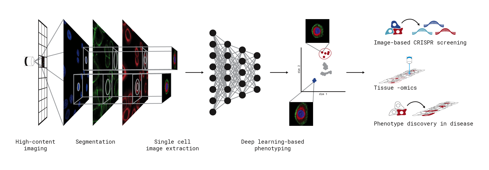

scPortrait - image-based single cell analysis at scale in Python
================================================================

scPortrait is a scalable toolkit to analyse single-cell image datasets. This Python implementation efficiently segments individual cells, generates single-cell datasets and provides tools for the efficient deep learning classification of their phenotypes for downstream applications.

Installation
=============

Check out the installation instructions :ref:`here<installation>`. You can validate your installation by running one of the example notebooks `here <https://github.com/MannLabs/scPortrait/tree/main/docs_source/pages/notebooks>`_.

Getting Started
===============

You can check out our :ref:`introduction<introduction>` to get started with scPortrait. For more detailed information on the package, we have written an in depth :ref:`computational workflow <pipeline>` guide. In the github repository you can also find some `tutorial notebooks <https://github.com/MannLabs/scPortrait/tree/main/docs_source/pages/notebooks>`_ as well as `small example datasets <https://github.com/MannLabs/SPARCSspatial/tree/main/example_data>`_ to get started with. If you encounter issues feel free to `open up a git issue <https://github.com/MannLabs/scPortrait/issues>`_.

Citing our Work
================

scPortrait was developed by Sophia Mädler and Niklas Schmacke in the labs of `Matthias Mann <https://www.biochem.mpg.de/de/mann>`_, `Veit Hornung <https://www.genzentrum.uni-muenchen.de/research-groups/hornung/index.html>`_ and `Fabian Theis <https://www.helmholtz-munich.de/en/icb/research-groups/theis-lab>`_ in 2024 and is actively being developed. If you are interested in contributing please reach out to the developers.

If you use our code please cite the `following manuscript <https://doi.org/10.1101/2023.06.01.542416>`_:

SPARCS, a platform for genome-scale CRISPR screening for spatial cellular phenotypes
Niklas Arndt Schmacke, Sophia Clara Maedler, Georg Wallmann, Andreas Metousis, Marleen Berouti, Hartmann Harz, Heinrich Leonhardt, Matthias Mann, Veit Hornung
bioRxiv 2023.06.01.542416; doi: https://doi.org/10.1101/2023.06.01.542416

Contributing
============

We are excited for people to adapt and extend scPortrait to their needs. If you are interested in contributing to scPortrait, please reach out to the developers or open a pull request on our `GitHub repository <https://github.com/MannLabs/scPortrait>`_.

Documentation
==============

.. toctree::
   :maxdepth: 2
   :caption: Ecosystem

   pages/installation/
   pages/introduction/
   pages/pipeline/
   pages/tutorials

.. toctree::
   :maxdepth: 2
   :caption: Tools

   pages/tools/parsing/parsing
   pages/tools/stitching/stitching

.. toctree::
   :maxdepth: 2
   :includehidden:
   :caption: Module API

   pages/module
