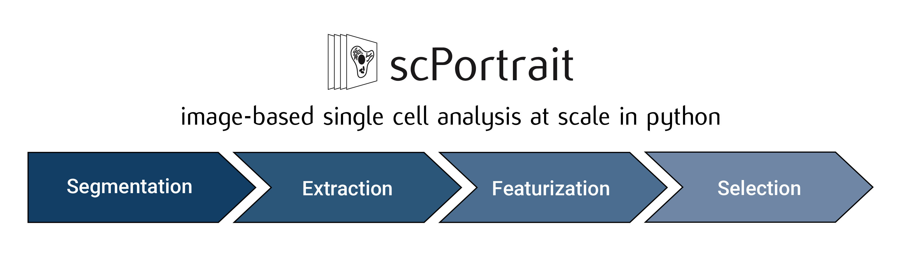
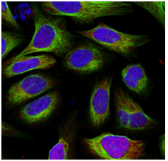
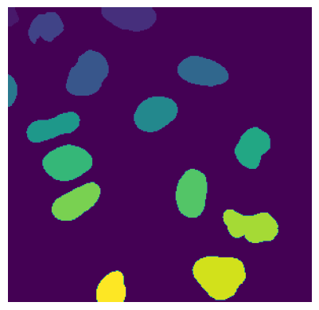
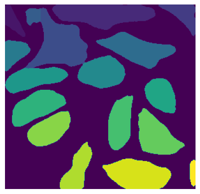
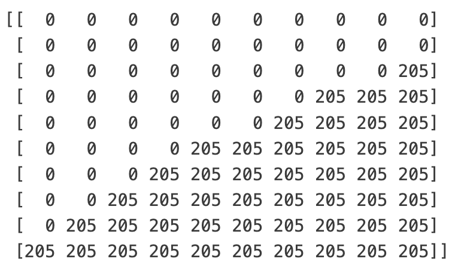
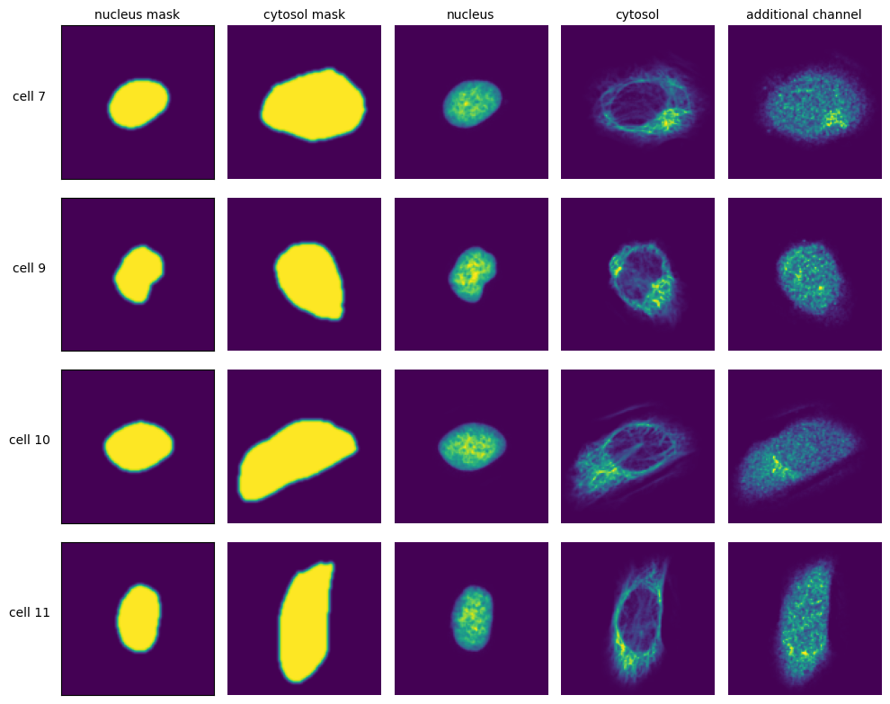

.. _introduction:

************
Introduction
************

The scPortrait workflow consists of up to 5 steps:
  1. :ref:`Stitching <quickstart_stitching>`: Stitching of input images to create a single whole-slide image. This step is optional and depends on the type of data that is to be processed.

  2. :ref:`Segmentation <quickstart_segmentation>`: Generates masks for the segmentation of input images into individual cells. Depending on the desired type of segmentation, different segmentation methods can be selected.

  3. :ref:`Extraction <quickstart_extraction>`: The segmentation masks are applied to extract single-cell images for all cells in the input images. Images of individual cells are rescaled to [0, 1] per channel.

  4. :ref:`Featurization <quickstart_featurization>`: The image-based phenotype of each individual cell in the extracted single-cell dataset is classified using the specified classification method. Multiple classification runs can be performed on the same dataset using different classification methods.

  5. :ref:`Selection <quickstart_selection>`: Cutting instructions for the isolation of selected individual cells by laser microdissection are generated. The cutting shapes are written to an ``.xml`` file which can be loaded on a leica LMD microscope for automated cell excision.

The results from each processing step are saved to file and logs generated in seperate subfolders in the main project directory. For each processing step, different methods can be chosen and their parameters specified via the ``config.yml`` file.

.. _quickstart_stitching:

Stitching
=========

During stitching, individual fields-of-view are registered and combined into a single whole-slide image. Using parallel processing and out-of-memory computation scPortrait can efficiently align and assemble large
datasets that exceed the memory capacities of a single machine. The stitching process is optional and can be skipped if the input images are already in the form of a single whole-slide image or individual images need to be processed.

.. _quickstart_segmentation:

Segmentation
============

The cell segmentation process in scPortrait is split into two parts: **nuclear segmentation**, which identifies nuclei in the input image, and **cytoplasmic segmentation**, which identifies cytosols. Depending on the dataset and/or application it is possible that only one of the two segmentation types is required. In this case, the segmentation process can be configured to only perform a nuclear or a cytoplasmic segmentation.

+-----------------------+-----------------------+-----------------------+
| Input Image           | Nucleus Mask          | Cytosol Mask          |
+-----------------------+-----------------------+-----------------------+
| |pic1|                | |pic2|                | |pic3|                |
+-----------------------+-----------------------+-----------------------+

During the segmentation process, a mask is generated which maps the pixels of the input image to individual cells, which are then assigned a unique ``cell id``. Background pixels are assigned the value ``0``.

If we zoomed in on the corner of the segmentation mask of a nucleus, the segmentation mask (a numpy array) would look like this:

+-----------------------+-----------------------+
| Nucleus Mask as Image | Nucleus Mask as array |
+-----------------------+-----------------------+
| |pic4|                | |pic5|                |
+-----------------------+-----------------------+

In this example the depicted cell has the ``cell id`` 205. The ``cell id`` s assigned during the segmentation process are permanent: They are preserved throughout a scPortrait run. This allows you to trace individual cells back through to the original input image at any step.

.. _quickstart_extraction:

Extraction
==========

The scPortrait framework is built around the idea of generating standardized single-cell image datasets. A scPortrait single cell image dataset consists of a collection of images for each cell, containing both the segmentation masks and imaging channels of that particular cell. Aggregated across all cells in a scPortrait dataset, these image collections are saved as ``HDF5``, a container file format that enables the retrieval of individual cells without loading the entire dataset. These ``HDF5`` datasets are created during the extraction step.

To crop out image regions corresponding to individual cells, the extraction step takes the segmentation masks generated during the segmentation step and applies them to the original image. By using the segmentation masks to extract only those pixels that are annotated to belong to a given cell, scPortrait achieves exact clipping of individual cells from their background, eliminating noise from neighbouring cells. This makes scPortrait ideally suited to processing data from experiments in which single cell resolution is required, for example in pooled genetic screening.
During the extraction process, all single cell images are also centered on their respective nuclei.

The size in px of the output images can be set in the ``config.yml`` file and typically depends on the resolution of the input images as well as the physical size of the imaged cells. In our `first publication <https://doi.org/10.1101/2023.06.01.542416>`_ we extracted single cell images of U2OS cells from original images captured at 20X magnification at a size of 128 x 128px. Extraction is only performed on cells that were fully imaged, i.e. their masks do not intersect with the image borders.

.. _quickstart_featurization:

Featurization
==============

During featurization, the extracted single cell images are passed to a phenotype analysis method that either calculates a set of features for each cell or directly assigns a class label to each cell. This analysis method will need to be adapted to each use case. For example, in our `first publication <https://doi.org/10.1101/2023.06.01.542416>`_ we describe a deep learning-based binary image classifier that identifies individual cells defective in a biological process called "autophagy". Multiple classification runs can be performed on the same dataset so that different classification approaches can be used in parallel.

.. _quickstart_selection:

Selection
=========

The selection step takes a list of cells that have been selected based on their classification and transforms their appearance into cutting shapes that can be loaded onto a Leica LMD microscope for excision. To accurately map the generated cutting shapes to their precise location on the input slide, the position of three calibration marks also needs to be passed to this method. During this process the cutting shapes are optimized for laser microdissection for example by applying an erosion or dilation or by smoothing the shapes. Please see the `py-lmd <https://github.com/MannLabs/py-lmd>`_ library for more details on the available parameters.
