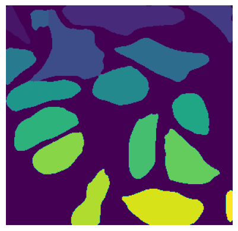
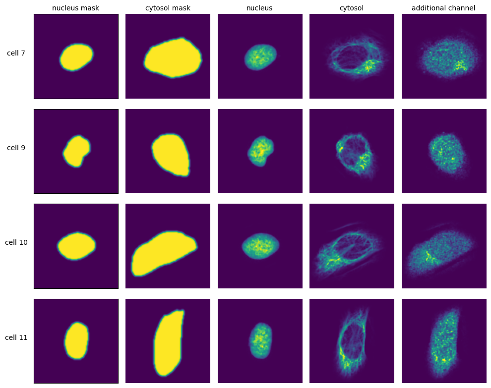
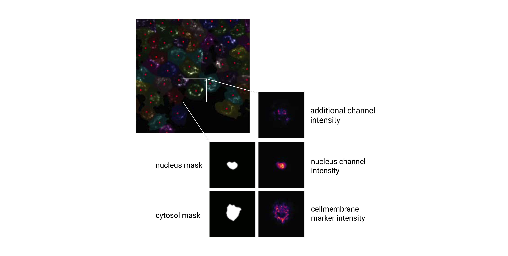

.. _workflow:

************
Workflow
************

scPortrait, is a computational framework for transforming raw microscopy images into single cell image datasets that can directly be used for training deep learning models. scPortrait efficiently segments individual cells, generates single-cell datasets and provides tools for the efficient deep learning classification of their phenotypes for downstream applications. scPortrait solves several challenges that come with scaling image operations to millions of cells allowing for the processing of extremely large image datasets.

.. image:: images/scportrait_workflow_steps.png
   :width: 100%
   :align: center
   :alt: scPortrait workflow steps: Segmentation, Extraction, Classification, Selection

The scPortrait workflow consists of up to 5 steps:

  1. :ref:`Stitching <quickstart_stitching>`: Stitching of input images to create a single whole-slide image. This step is optional and depends on the type of data that is to be processed.

  2. :ref:`Segmentation <quickstart_segmentation>`: Generates masks for the segmentation of input images into individual cells. Depending on the desired type of segmentation, different segmentation methods can be selected.

  3. :ref:`Extraction <quickstart_extraction>`: The segmentation masks are applied to extract single-cell images for all cells in the input images. Images of individual cells are rescaled to [0, 1] per channel.

  4. :ref:`Featurization <quickstart_featurization>`: The image-based phenotype of each individual cell in the extracted single-cell dataset is featurized using the specified featurization method. Multiple featurization runs can be performed on the same dataset using different methods.

  5. :ref:`Selection <quickstart_selection>`: Cutting instructions for the isolation of selected individual cells by laser microdissection are generated. The cutting shapes are written to an ``.xml`` file which can be loaded on a leica LMD microscope for automated cell excision.

In scPortrait, all operations are centered around the ``scPortrait Project`` class. For each dataset that is to be processed, a new instance of the ``scPortrait Project`` class is created which then manages the entire computational workflow.
Using a plug and play approach, a specific analysis workflow can be construted by specifying different method classes for each of the processing steps. The execution of the workflow is then controlled by the ``scPortrait Project`` class which calls the methods of the assigned method classes in the correct order and saves the results to disk in a standardized format.

To ensure maximum compatibility with other Python libraries, scPortrait is part of the `scverse ecosystem <https://scverse.org>`_ and utilizes the `SpatialData <https://spatialdata.scverse.org/en/latest/>`_ format for saving input images, generated segmentation masks and annotations.
For more information on how scPortrait uses SpatialData please refer to the :ref:`SpatialData` section.

.. _quickstart_stitching:

Stitching
=========

During stitching, individual fields-of-view are registered and combined into a single whole-slide image. Using parallel processing and out-of-memory computation scPortrait can efficiently align and assemble large
datasets that exceed the memory capacities of a single machine. The stitching process is optional and can be skipped if the input images are already in the form of a single whole-slide image or individual images need to be processed.

You can find an example notebook illustrating the stitching of individual tif files to whole-slide images :ref:`in the stitching tutorial <example_stitching>`

.. _quickstart_segmentation:

Segmentation
============

The cell segmentation process in scPortrait is split into two parts: **nuclear segmentation**, which identifies nuclei in the input image, and **cytoplasmic segmentation**, which identifies cytosols. Depending on the dataset and/or application it is possible that only one of the two segmentation types is required. In this case, the segmentation process can be configured to only perform a nuclear or a cytoplasmic segmentation.

.. .. |pic1| image:: images/input_image.png
..    :width: 100%

.. .. |pic2| image:: images/nucleus_mask.png
..    :width: 50%

.. .. |pic3| image:: images/cytosol_mask.png
..    :width: 50%

.. |pic1| image:: images/input_image.png
   :class: responsive-img

.. |pic2| image:: images/nucleus_mask.png
   :class: responsive-img

+-----------------------+-----------------------+-----------------------+
| Input Image           | Nucleus Mask          | Cytosol Mask          |
+-----------------------+-----------------------+-----------------------+
| |pic1|                | |pic2|                | |pic3|                |
+-----------------------+-----------------------+-----------------------+

During the segmentation process, a mask is generated which maps the pixels of the input image to individual cells, which are then assigned a unique ``cell id``. Background pixels are assigned the value ``0``.

If we zoomed in on the corner of the segmentation mask of a nucleus, the segmentation mask (a numpy array) would look like this:

.. |pic4| image:: images/nucleus_mask_excerpt.png
   :width: 100%

.. |pic5| image:: images/nucleus_mask_numeric.png
   :width: 100%

+-----------------------+-----------------------+
| Nucleus Mask as Image | Nucleus Mask as array |
+-----------------------+-----------------------+
| |pic4|                | |pic5|                |
+-----------------------+-----------------------+

In this example the depicted cell has the ``cell id`` 205. The ``cell id`` s assigned during the segmentation process are permanent: They are preserved throughout a scPortrait run. This allows you to trace individual cells back through to the original input image at any step.

scPortrait implements different :ref:`segmentation strategies <segmentation_classes>` allowing you to scale your processing to larger-than-memory datasets, as well as a variety of different :ref:`segmentation algorithms <segmentation_workflows>`. Due to its modular design, it is easy to implement new segmentation approaches in scPortrait if the provided methods do not fit your specific use case.

.. _quickstart_extraction:

Extraction
==========

The scPortrait framework is built around the idea of generating standardized single-cell image datasets. A scPortrait single cell image dataset consists of a collection of images for each cell, containing both the segmentation masks and imaging channels of that particular cell as well as their annotation.
Aggregated across all cells in a scPortrait dataset, these image collections are saved in a standardized container format, built on [AnnData](https://github.com/scverse/anndata). The format enables the retrieval of individual cells without loading the entire dataset  into memory. You can find more information on the specifications of the standardized single-cell image file-format developed in scPortrait  :ref:`here <single_cell_image_datasets>`.

To crop out image regions corresponding to individual cells, the extraction step takes the segmentation masks generated during the segmentation step and applies them to the original image.
By using the segmentation masks to extract only those pixels that are annotated to belong to a given cell, scPortrait achieves exact clipping of individual cells from their background, eliminating noise from neighbouring cells.
This makes scPortrait ideally suited to processing data from experiments in which single cell resolution is required, for example in pooled genetic screening.

Extraction is only performed on cells that were fully imaged, i.e. their masks do not intersect with the image borders. All pixels within the mask dimensions are preserved, while the pixels outside of the mask are set to ``0``. Furthermore, all single cell images are centered on their respective nuclei and the resulting single-cell images normalized to the [0, 1] range using a percentile-normalization. This reduces the effect of imaging batch effects on generated featurizations from the resulting single-cell images. In cases where no normalization is desired, or the normalization behaviour needs to be adjusted this behaviour can be fine-tuned by updating the parameters in the ``config.yml`` file. The size in px of the resulting single-cell images can also be adjusted in the ``config.yml`` file and typically depends on the resolution of the input images as well as the physical size of the imaged cells. In our `first publication <https://doi.org/10.1101/2023.06.01.542416>`_ we extracted single cell images of U2OS cells from original images captured at 20X magnification at a size of 128 x 128px.

.. _quickstart_featurization:

Featurization
==============

During featurization, the extracted single cell images are passed to a phenotype analysis method that either generates a set of features for each cell or directly assigns a class label. This allows you to analyse the phenotpyes of individual cells isolated from theirs neighbors. scPortrait is compatible with various phenotyping techniques ranging from classical image analysis methods, for example those provided by `scikit-image <https://scikit-image.org/>`_ to recent deep learning-based computer vision models. scPortrait provides a pytorch dataloader for its HDF5-based dataset format, enabling inference with existing pytorch models and facilitating training new or finetuning existing models with your own data.

The type of featurization applicable to your use case will depend on the type of data you are working with and the biological question you are trying to answer. For example, in our `first publication <https://doi.org/10.1101/2023.06.01.542416>`_ we describe a deep learning-based binary image classifier that identifies individual cells defective in a biological process called "autophagy". Multiple featurization runs can be performed on the same dataset so that different featurization approaches can be used in parallel.

You can find more information on running an inference within a scPortrait Project in this `classification notebook <https://mannlabs.github.io/scPortrait/html/pages/notebooks/example_scPortrait_project.html#Classification-of-extracted-single-cells>`_.

.. _quickstart_selection:

Selection
=========

The selection step takes a list of cells that have been selected based on their features or classification scores and transforms their appearance into cutting shapes that can be loaded onto a Leica LMD microscope for fully automated laser microdissection. This process is facilitated by the `py-lmd <https://github.com/MannLabs/py-lmd>`_ library.

During selection, the appearance of selected cells can be modified, e.g. by applying an erosion or dilation or by smoothing the shapes to further stream-line the excision process. Please refer to the `py-lmd <https://github.com/MannLabs/py-lmd>`_ library for more details on the available parameters.

You can also find an example selection workflow outlined in this `selection notebook <https://mannlabs.github.io/scPortrait/html/pages/notebooks/example_scPortrait_project.html#Exporting-Cutting-contours-for-excision-on-a-Leica-LMD7>`_.

.. _detailed_guide:

.. toctree::
   :maxdepth: 2
   :caption: Topic Deep Dives

   workflow/package_design
   workflow/project
   workflow/config
   workflow/spatialdata
   workflow/segmentation_workflow
   workflow/single_cell_image_format
   workflow/featurization_methods
