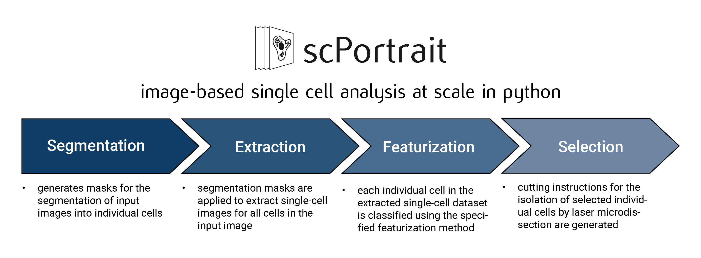
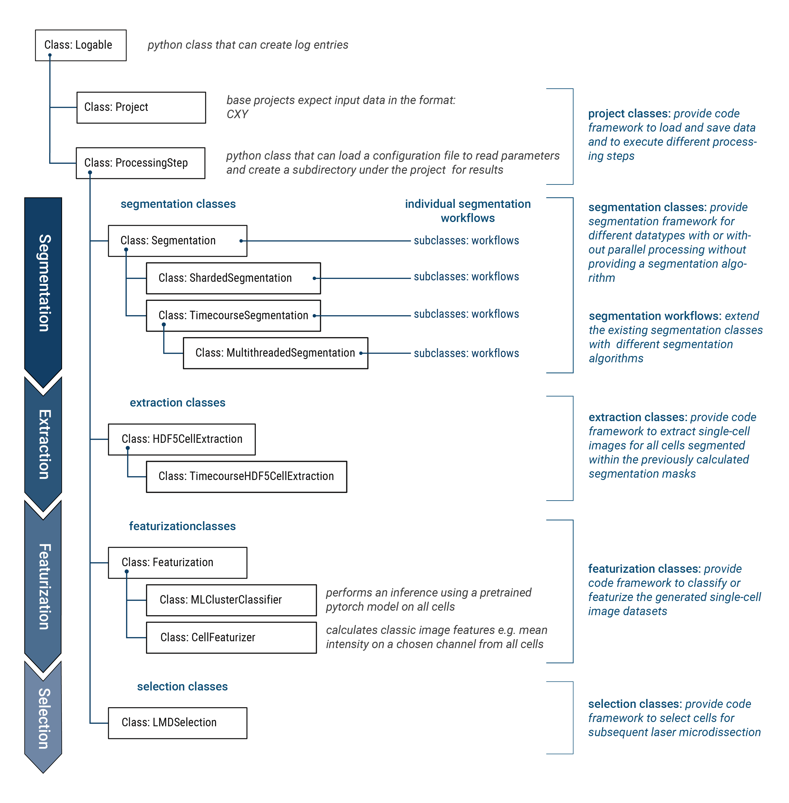

.. _package_design:

Package Design
===================

In scPortrait, all operations are centered around the ``scPortrait Project`` class. For each dataset that is to be processed, a new instance of the ``scPortrait Project`` class is created which then manages the entire computational workflow. Using a plug and play approach, a specific analysis workflow can be construted by specifying different method classes for each of the processing steps. The execution of the workflow is then controlled by the ``scPortrait Project`` class which calls the methods of the assigned method classes in the correct order and saves the results to disk in a standardized format.

To ensure maximum compatibility with other Python libraries, scPortrait is part of the `scverse ecosystem <https://scverse.org>`_ and utilizes the `SpatialData <https://spatialdata.scverse.org/en/latest/>`_ format for saving input images, generated segmentation masks and annotations. For more information on how scPortrait uses SpatialData please refer to the :ref:`SpatialData` section.

scPortaits computational workflow is designed to be modular and flexible and is designed around the concept of class inheritance. Class inheritance is a fundamental object-oriented programming concept that allows a new class (subclass or derived class) to inherit attributes and methods from an existing class (superclass or base class). Using this concept, scPortrait provides a base implementation for each processing step. This base class can then be extended by subclasses which modify the behavior of this specific step without needing to reimplement shared processes. So for example, a new segmentation class utilizing a different segmentation algorithm only needs to provide an updated method for calculating the segmentation mask, but can utilize the rest of the segmentation framework, like loading or saving data, already provided by the base class. Using class inheritance ensures that the computation workflow is extensible and flexible, while at the same time providing a stardardized framework for each processing steps.

    Inheritance Hierarchy of scPortrait classes

By implementign this type of design we aim to make the package accessible to users with limited programming experience, while at the same time providing a flexible and extensible framework for more advanced users.
