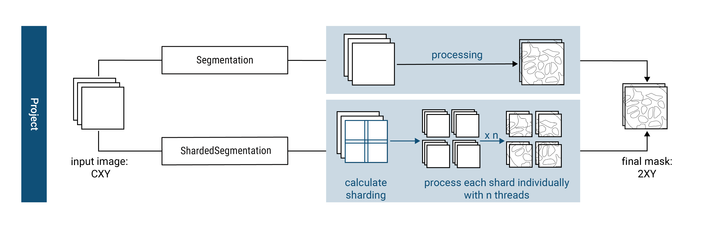
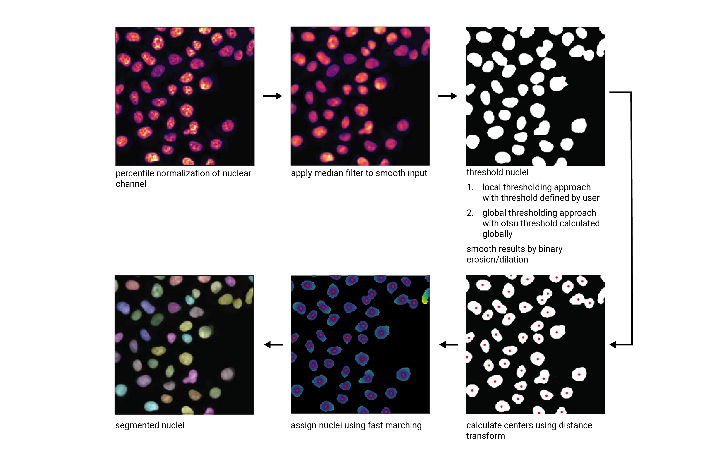
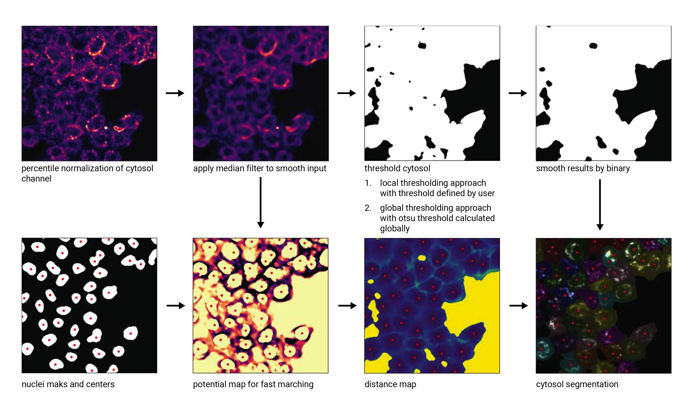

.. _segmentation_workflow:

Segmentation
============

To ensure overall flexibility, scPortrait seperates code implementing the segmentation framework (i.e. how input data is loaded, segmentation methods are called or results saved) from the code implementing the actual segmentation algorithm (i.e. how the segmentation mask is calculated for a given input). This allows you to easily exchange one segmentation algorithm for another while retaining the rest of the code framework.

Segmentation frameworks are implemented as so-called `segmentation classes` and segmentation algorithms are implemented as so-called `segmentation workflows`.
Each segmentation class is optimized for a given input data format and level of parallelization, and each workflow implements a different segmentation algorithm (e.g. thresholding based segmentation or deep learning based segmentation).

.. _segmentation_classes:

Segmentation classes
--------------------

scPortrait currently implements two different segmentation classes for each of the input data formats: a serialized segmentation class and a parallelized segmentation class. The serialized segmentation class is ideal for segmenting small input images in a single process. The parallelized segmentation classes can process larger-than-memory input images over multiple CPU cores.

1. Segmentation
+++++++++++++++

The :func:`Segmentation <scportrait.pipeline.segmentation.Segmentation>` class is optimized for processing input images of the format CXY within the context of a base scPortrait :func:`Project <scportrait.pipeline.project.Project>`. It loads the input image into memory and then segments the image using the provided segmentation workflow. The resulting segmentation mask is then saved to disk.

2. ShardedSegmentation
++++++++++++++++++++++

The :func:`ShardedSegmentation <scportrait.pipeline.segmentation.ShardedSegmentation>` class is an extension of the :func:`Segmentation <scportrait.pipeline.segmentation.Segmentation>` class which is optimized for processing large input images in the format CXY in a parallelized fashion. When loading the input image, the :func:`ShardedSegmentation <scportrait.pipeline.segmentation.ShardedSegmentation>` class splits the provided image into smaller tiles, called shards, which can then be processed individually in a parallelized fashion. After segmentation of the individual shards is completed, the :func:`ShardedSegmentation <scportrait.pipeline.segmentation.ShardedSegmentation>` class merges the individual tiles back together to generate a final segmentation mask which extends over the complete input image.

Using a shardings approach has two main advantages:

    1. the possibility to segment images larger than the available memory the segmentation of images
    2. the parallelized segmentation of shards over mutiple threads to better utilize the available hardware

To determine how many shards should be generated, the user specifies the maximum number of pixels that can be allocated to one shard via the configuration file (``shard_size``). scPortrait then dynamically calculates a so-called `sharding plan` which splits the input image into the minimum number of equally sized shards. If desired, the user can also specify a pixel overlap (``overlap_px``) which determines how far the shards should overlap. This can be useful to ensure that cells which are located on the border between two shards are still fully segmented.

The :func:`ShardedSegmentation <scportrait.pipeline.segmentation.ShardedSegmentation>` class then segments each of the calculated shards individually using the designated number of parallel processes (``threads``). The intermediate segmentation results from each shard are saved to disk  before proceeding with the next shard. This ensures that memory usage during the segmentation process is kept to a minimum as only the required data to calculate the current shard segmentation are retained in memory.

After segmentation of each individual shard is completed, the :func:`ShardedSegmentation <scportrait.pipeline.segmentation.ShardedSegmentation>` class merges the individual segmentation masks back together to generate a final segmentation mask which extends over the complete input image. During this process the ``cell ids`` are adjusted on each shard so that they remain unique throughout the final segmentation mask. After this process is completed the final segmentation mask is saved to disk and all intermediate results are deleted.

Configuration parameters
^^^^^^^^^^^^^^^^^^^^^^^^

The following parameters for a sharded segmentation need to be specified in the configuration file:

.. code:: yaml

    ShardedSegmentationWorkflow:
        shard_size: 1000000000 # maximum number of pixels that can be allocated to one shard
        overlap_px: 0 # number of pixels by which the shards should overlap
        threads: 2 # number of threads to be used for parallelized segmentation of shards
        ... additional workflow specific parameters...

.. 3. TimecourseSegmentation
.. +++++++++++++++++++++++++

.. The :func:`TimecourseSegmentation <scportrait.pipeline.segmentation.TimecourseSegmentation>` class is optimized for processing input images of the format NCXY within the context of a scPortrait :func:`Timecourse Project <scportrait.pipeline.project.TimecourseProject>`. It loads the input images into memory and segments them sequentially using the provided segmentation workflow. The resulting segmentation masks are then saved to disk.

.. 4. MultithreadedSegmentation
.. ++++++++++++++++++++++++++++

.. The :func:`MultithreadedSegmentation <scportrait.pipeline.segmentation.MultithreadedSegmentation>` class is an extension of the :func:`TimecourseSegmentation <scportrait.pipeline.segmentation.TimecourseSegmentation>` class and segments input images in the format NCYX in a parallelized fashion. The parallelization is achieved by splitting the input images along the N axis and processing each imagestack individually. The number of parallel processes can be specified by the user via the configuration file (``threads``).

.. Configuration parameters
.. ^^^^^^^^^^^^^^^^^^^^^^^^

.. The following parameters for a multithreaded segmentation need to be specified in the configuration file:

.. .. code:: yaml

..     MultithreadedSegmentationWorkflow:
..         threads: 2 # number of threads to be used for parallelized segmentation of shards
..         ... additional workflow specific parameters...

.. _segmentation_workflows:

Segmentation Workflows
----------------------

Within scPortrait a segmentation workflow refers to a specific segmentation algorithm that can be called by one of the segmentation classes described above. Currently the following segmentation workflows are available for each of the different segmentation classes. They are explained in more detail below:

- :ref:`WGA_segmentation`
- :ref:`DAPI_segmentation`
- :ref:`Cytosol_segmentation_cellpose`
- :ref:`DAPI_segmentation_cellpose`
- :ref:`cytosol_only_segmentation_cellpose`

If none of these segmentation approaches suit your particular needs you can easily implement your own workflow. In case you need help, please open a git issue.

Workflow overview
+++++++++++++++++

Test goes here.

Configuring a segmentation workflow
+++++++++++++++++++++++++++++++++++

Workflow specific parameters are stored in config files
^^^^^^^^^^^^^^^^^^^^^^^^^^^^^^^^^^^^^^^^^^^^^^^^^^^^^^^

The specific behaviour of a segmentation workflow is determined by the parameters in the supplied config file that is used to initialize the project. While different segmentation methods each have unique parameters that are required for the selected segmentation algorithm, all workflows share some common keys and a common structure.

Here is a strongly simplified config for a generic scPortrait Segmentation Workflow:

..  code-block:: yaml
    :caption: Simplified configuration for a generic scPortrait Segmentation Workflow

    {SegmentationWorkflow}:
        cache: "/path/to/directory/to/use/for/memorymapping/intermediate/results
        nucleus_segmentation:
            # parameters specific to nucleus segmentation method go here
            key: value
            # if `filter_masks_size` is set to True then the min and max size in px for each nucleus mask can be configured through these parameters
            min_size: 200
            max_size: 30000
        cytosol_segmentation
            # parameters specific to cytosol segmentation method go here
            key: value
            # if `filter_masks_size` is set to True then the min and max size in px for each cytosol mask can be configured through these parameters
            min_size: 200
            max_size: 30000
        match_masks: True
        filtering_threshold_mask_matching: 0.95
        filter_masks_size: False

Methods that only perform a nucleus or cytosol segmentation step will only need to provide the relevant parameters for the step that is executed.

As for all scPortrait configs, they can contain a mix of mandatory as well as optional parameters. If an optional parameter is not specified within a given config, scPortrait will use the default value for it. For some parameters there are no default values implemented, so its absolutely mandatory that you provide these yourself. In case you try and execute a run with an incomplete config (i.e. where a mandatory parameter is missing) scPortrait will inform you of this so that you can update your config file accordingly.

.. list-table::
   :widths: 10 40 15 25
   :header-rows: 1

   * - Parameter
     - Description
     - Optional
     - Default Value
   * - ``cache``
     - Specifies the directory to be used for out-of-memory backed computations.
     - True
     - Uses the current working directory, it is highly recommended to pass a specific directory though that is located on a fast-access drive (SSD).
   * - ``nucleus_segmentation``
     - Contains all parameters specific to the nuclear segmentation step.
     -
     -
   * - ``cytosol_segmentation``
     - Contains all parameters specific to the cytosolic segmentation step.
     -
     -
   * - ``filter_masks_size``
     - Determines if the resulting masks should be filtered according to size, with min/max cutoffs specified per segmentation step.
     - True
     - False
   * - ``min_size``
     - The minimum size in px that a mask needs to have to pass mask size filtering if ``filter_masks_size`` is ``True``.
     - Not optional if ``filter_masks_size`` is ``True``
     - None
   * - ``max_size``
     - The maximum size in px that a mask needs to have to pass mask size filtering if ``filter_masks_size`` is ``True``.
     - Not optional if ``filter_masks_size`` is ``True``
     - None
   * - ``match_masks``
     - Specifies whether cytosolic and nuclear segmentation masks should be matched. If enabled, cytosol masks that do not match exactly one nuclear mask are removed, and vice versa.
     - True
     - True for methods that generate both a nuclear as well as a cytosol mask
   * - ``filtering_threshold_mask_matching``
     - Defines the percentage of overlap required between a nuclear mask and a cytosol mask for them to be considered a match.
     - True
     - 0.95

Input Channels Required for Segmentation Algorithm
^^^^^^^^^^^^^^^^^^^^^^^^^^^^^^^^^^^^^^^^^^^^^^^^^^

To generate segmentation masks, you will usually not require all of the channels present in your input images.

The different segmentation workflows will automatically subset the provided input images to only run on the channels of interest. This ensures efficient computation, as only the absolutely required information is loaded into memory while everything else is left on disk.

Depending on the segmentation method, either 1 or 2 input channels will be required to generate a segmentation mask.

.. list-table::
   :widths: 35 30 35
   :header-rows: 1

   * - Segmentation Method
     - Number of Input Channels
     - Number of Output Masks
   * - `WGA Segmentation <WGA_segmentation>`_
     - 2
     - 2
   * - `DAPI Segmentation <DAPI_segmentation>`_
     - 1
     - 1
   * - `Cytosol Segmentation Cellpose <Cytosol_segmentation_cellpose>`_
     - 2
     - 2
   * - `DAPI Segmentation Cellpose <DAPI_segmentation_cellpose>`_
     - 1
     - 1
   * - `Cytosol Only Segmentation Cellpose <cytosol_only_segmentation_cellpose>`_
     - 2
     - 1

To automatically select the relevant input channels for segmentation, scPortrait assumes that you have loaded your input channels in the following order:

1. Nuclear marker channel
2. Cell membrane marker channel
3. All other channels

In some cases, you may want to customize this behavior, e.g., if you want to use a maximum-intensity projection of multiple input channels as a proxy for segmentation.

This behavior can also be modified through the configuration file. Below, we will illustrate a few different use cases.

Case 1: combine multiple channels through maximum-intensity projection
~~~~~~~~~~~~~~~~~~~~~~~~~~~~~~~~~~~~~~~~~~~~~~~~~~~~~~~~~~~~~~~~~~~~~~~

By adding a key with either `combine_nucleus_channels` or `combine_cytosol_channels` which provides a list of channel indices to combine you can perform a maximum intensity projection of the provided channel indexes before passing the newly generated channel to the respective segmentation algorithm.

..  code-block:: yaml
    :caption: Maximum-Intensity project channels before using as a reference for nucleus/cytosol segmentation

    cache: "/path/to/directory/to/use/for/memorymapping/intermediate/results
    nucleus_segmentation:
        # parameters specific to nucleus segmentation method go here
        key: value
    cytosol_segmentation
        # parameters specific to cytosol segmentation method go here
        key: value
    combine_nucleus_channels: [0, 2]
    combine_cytosol_channels: [1, 2]

Case 2: select different channel ids for segmentation because your channel order differs to the expected format
~~~~~~~~~~~~~~~~~~~~~~~~~~~~~~~~~~~~~~~~~~~~~~~~~~~~~~~~~~~~~~~~~~~~~~~~~~~~~~~~~~~~~~~~~~~~~~~~~~~~~~~~~~~~~~~~

You can override the default behaviour by manually suppling specific channel index ids that contain nuclear or cytoplasmic information.

..  code-block:: yaml
    :caption: override channel-ids for nuclear and or cytoplasmic stain location

    cache: "/path/to/directory/to/use/for/memorymapping/intermediate/results
    nucleus_segmentation:
        # parameters specific to nucleus segmentation method go here
        key: value
    cytosol_segmentation
        # parameters specific to cytosol segmentation method go here
        key: value
    segmentation_channel_nuclei: [2]
    segmentation_channel_cytosol: [2]

Case 3: do a combination of the two
~~~~~~~~~~~~~~~~~~~~~~~~~~~~~~~~~~~~~

Both use cases can of course also be combined. In case you pass both `combine_{mask_name}_channels` and `segmentation_channel_{mask_name}` with differing values, combine_channel_{mask_name} will superscede `segmentation_channel_{mask_name}`.

..  code-block:: yaml
    :caption: maximum-intensity projection of cytosol and custom nucleus channel id

    cache: "/path/to/directory/to/use/for/memorymapping/intermediate/results
    nucleus_segmentation:
        # parameters specific to nucleus segmentation method go here
        key: value
    cytosol_segmentation
        # parameters specific to cytosol segmentation method go here
        key: value
    segmentation_channel_nuclei: [2]
    combine_cytosol_channels: [1, 2]

Customize Cellpose Model Behaviour
^^^^^^^^^^^^^^^^^^^^^^^^^^^^^^^^^^

You can customize the specific behaviour of all cellpose models via the method specific config file.

..  code-block:: yaml
    :caption: Example configuration for  WGASegmentation

    {mask_name}_segmentation:
            model: "cyto2"
            model_path: "path/to/a/custom/cellpose/model"
            normalize: True
            diameter: None
            resample: True
            rescale: None
            flow_threshold: 0.4
            cellprob_threshold: 0.0

The indicated keys are wrappers for the parameters of `cellpose.models.CellposeModel.eval <https://cellpose.readthedocs.io/en/latest/api.html#id0>`_ and have the same function.

.. list-table::
   :widths: 20 40 20 20
   :header-rows: 1

   * - Parameter
     - Description
     - Optional
     - Default Value
   * - ``model``
     - Name of a built-in Cellpose model.
     - Only if ``model_path`` is provided instead.
     - ``None``
   * - ``model_path``
     - Path to a custom trained Cellpose model.
     - True
     - ``None``
   * - ``normalize``
     - Wrapper for Cellpose ``normalize`` parameter.
     - True
     - ``True``
   * - ``resample``
     - Wrapper for Cellpose ``resample`` parameter.
     - True
     - ``True``
   * - ``rescale``
     - Wrapper for Cellpose ``rescale`` parameter.
     - True
     - ``None``
   * - ``diameter``
     - Wrapper for Cellpose ``diameter`` parameter.
     - True
     - ``None``
   * - ``flow_threshold``
     - Wrapper for Cellpose ``flow_threshold`` parameter.
     - True
     - ``0.4``
   * - ``cellprob_threshold``
     - Wrapper for Cellpose ``cellprob_threshold`` parameter.
     - True
     - ``0.0``

Detailed Workflow Descriptions
+++++++++++++++++++++++++++++++

.. _WGA_segmentation:

WGA segmentation
^^^^^^^^^^^^^^^^^

This segmentation workflow aims to segment mononucleated cells, i.e. cells that contain exactly one nucleus. Based on a nuclear stain and a cellmembrane stain, it first uses a thresholding approach to identify nuclei which are assumed to be the center of each cell. Then in a second step, the center of the identified nuclei are used as a starting point to generate a potential map using the cytosolic stain. This potential map is then used to segment the cytosol using a watershed approach. At the end of the workflow the user obtains both a nuclear and a cytosolic segmentation mask where each cytosol is matched to exactly one nucleus as kann be identified by the matching ``cell id``.

This segmentation workflow is implemented to only run on the CPU. As such it can easily be scaled up to run on large datasets using parallel processing over multiple cores using either the :func:`ShardedSegmentation <scportrait.pipeline.segmentation.ShardedSegmentation>` class or the :func:`MultithreadedSegmentation <scportrait.pipeline.segmentation.MultithreadedSegmentation>` class respectively. However, it has a lot of parameters that need to be adjusted for different datasets to obtain an optimal segmentation.

..  code-block:: yaml
    :caption: Example configuration for  WGASegmentation

    WGASegmentation:
        lower_quantile_normalization:   0.001
        upper_quantile_normalization:   0.999
        median_filter_size:   4 # Size in pixels
        nucleus_segmentation:
            lower_quantile_normalization:   0.01 # quantile normalization of dapi channel before local tresholding. Strong normalization (0.05,0.95) can help with nuclear speckles.
            upper_quantile_normalization:   0.99 # quantile normalization of dapi channel before local tresholding. Strong normalization (0.05,0.95) can help with nuclear speckles.
            median_block: 41 # Size of pixel disk used for median, should be uneven
            median_step: 4
            threshold: 0.2 # threshold above local median for nuclear segmentation
            min_distance: 8 # minimum distance between two nucleis in pixel
            peak_footprint: 7 #
            speckle_kernel: 9 # Erosion followed by Dilation to remove speckels, size in pixels, should be uneven
            dilation: 0 # final dilation of pixel mask
            min_size: 200 # minimum nucleus area in pixel
            max_size: 1000 # maximum nucleus area in pixel
            contact_filter: 0.5 # minimum nucleus contact with background
        cytosol_segmentation:
            threshold: 0.05 # treshold above which cytosol is detected
            lower_quantile_normalization: 0.01
            upper_quantile_normalization: 0.99
            erosion: 2 # erosion and dilation are used for speckle removal and shrinking / dilation
            dilation: 7 # for no change in size choose erosion = dilation, for larger cells increase the mask erosion
            min_clip: 0
            max_clip: 0.2
            min_size: 200
            max_size: 6000
        chunk_size: 50
        filter_masks_size: True

Nucleus Segmentation Algorithm
~~~~~~~~~~~~~~~~~~~~~~~~~~~~~~

Cytosol Segmentation Algorithm
~~~~~~~~~~~~~~~~~~~~~~~~~~~~~~

.. _DAPI_segmentation:

DAPI segmentation
^^^^^^^^^^^^^^^^^

This segmentation workflow aims to only segment nuclei. Based on a nuclear stain, it uses the same thresholding approach used during the WGA segmentation to identify nuclei. To ensure compatability with the downstream extraction workflow which assumes the presence of both a nuclear and a cytosolic segmentation mask the nuclear mask is duplicated and also used as the cytosolic mask. The generated single cell datasets using this segmentation method only focus on signals contained within the nuclear region.

..  code-block:: yaml
    :caption: Example configuration for  WGASegmentation

    DAPISegmentation:
        input_channels: 3
        chunk_size: 50 # chunk size for chunked HDF5 storage. is needed for correct caching and high performance reading. should be left at 50.
        lower_quantile_normalization:   0.001
        upper_quantile_normalization:   0.999
        median_filter_size:   4 # Size in pixels
        nucleus_segmentation:
            lower_quantile_normalization:   0.01 # quantile normalization of dapi channel before local tresholding. Strong normalization (0.05,0.95) can help with nuclear speckles.
            upper_quantile_normalization:   0.99 # quantile normalization of dapi channel before local tresholding. Strong normalization (0.05,0.95) can help with nuclear speckles.
            median_block: 41 # Size of pixel disk used for median, should be uneven
            median_step: 4
            threshold: 0.2 # threshold above which nucleus is detected, if not specified a global threshold is calcualted using otsu
            min_distance: 8 # minimum distance between two nucleis in pixel
            peak_footprint: 7 #
            speckle_kernel: 9 # Erosion followed by Dilation to remove speckels, size in pixels, should be uneven
            dilation: 0 # final dilation of pixel mask
            min_size: 200 # minimum nucleus area in pixel
            max_size: 5000 # maximum nucleus area in pixel
            contact_filter: 0.5 # minimum nucleus contact with background
        chunk_size: 50

Nucleus Segmentation Algorithm
~~~~~~~~~~~~~~~~~~~~~~~~~~~~~~

.. _Cytosol_segmentation_cellpose:

Cytosol Cellpose segmentation
^^^^^^^^^^^^^^^^^^^^^^^^^^^^^

This segmentation workflow is built around the cellular segmentation algorithm `cellpose <https://cellpose.readthedocs.io/en/latest/>`_ . Cellpose is a deep neural network with a U-net style architecture that was trained on large datasets of microscopy images of cells. It provides very accurate out of the box segmentation models for both nuclei and cytosols but also allows you to fine-tune models using your own data.

The scPortrait implementation of the cellpose segmenation algorithm allows you to perform both a nuclear and cytosolic segmentation and align the ``cellids`` between the two resulting masks. This means that the nucleus and the cytosol belonging to the same cell have the same ``cellids``. Furthermore, it performs some filtering steps to remove the masks from multi-nucleated cells or those with only a nuclear or cytosolic mask. This ensures that only cells which show a normal physiology are retained for further analysis.

While this segmentation workflow is also capable of running on a CPU it is highly recommended to utilize a GPU for better performance. If your system has more than one GPU available, in a ShardedSegmentation context, you can specify the number of GPUs to be used via the configuration file (``nGPUs``).

If you utilize this segmentation workflow please also consider citing the `cellpose paper <https://www.nature.com/articles/s41592-022-01663-4#Sec8>`_.

..  code-block:: yaml
    :caption: Example configuration for  Sharded Cytosol Cellpose Segmentation

    ShardedCytosolSegmentationCellpose:
        shard_size: 2000000 # maxmimum number of pixel per tile
        overlap_px: 100
        nGPUs: 1
        threads: 2 # number of shards / tiles segmented at the same size. should be adapted to the maximum amount allowed by memory.
        cache: "."
        nucleus_segmentation:
            model: "nuclei"
        cytosol_segmentation:
            model: "cyto2"
        match_masks: True
        filter_masks_size: False

.. _DAPI_segmentation_cellpose:

DAPI Cellpose segmentation
^^^^^^^^^^^^^^^^^^^^^^^^^^

This segmentation workflow is also built around the cellular segmentation algorithm `cellpose <https://cellpose.readthedocs.io/en/latest/>`_  but only performs a nuclear segmentation. This algorithm only takes a single input channel to generate a single output mask. The generated single cell datasets using this segmentation method only focus on signals contained within the nuclear region.

As for the :ref:`cytosol segmentation cellpose <Cytosol_segmentation_cellpose>` workflow it is highly recommended to utilize a GPU. If your system has more than one GPU available, in a ShardedSegmentation context, you can specify the number of GPUs to be used via the configuration file (``nGPUs``).

If you utilize this segmentation workflow please also consider citing the `cellpose paper <https://www.nature.com/articles/s41592-022-01663-4#Sec8>`_.

..  code-block:: yaml
    :caption: Example configuration for  DAPI Cellpose segmentation

    ShardedDAPISegmentationCellpose:
        #segmentation class specific
        input_channels: 2
        output_masks: 2
        shard_size: 120000000 # maxmimum number of pixel per tile
        overlap_px: 100
        chunk_size: 50 # chunk size for chunked HDF5 storage. is needed for correct caching and high performance reading. should be left at 50.
        cache: "/fs/pool/pool-mann-maedler-shared/temp"
        # segmentation workflow specific
        nGPUs: 2
        lower_quantile_normalization:   0.001
        upper_quantile_normalization:   0.999
        median_filter_size: 6 # Size in pixels
        nucleus_segmentation:
            model: "nuclei"

.. _cytosol_only_segmentation_cellpose:

Cytosol Only Cellpose segmentation
^^^^^^^^^^^^^^^^^^^^^^^^^^^^^^^^^^

This segmentation workflow is also built around the cellular segmentation algorithm `cellpose <https://cellpose.readthedocs.io/en/latest/>`_  but only performs a cytosol segmentation. Unlike the :ref:`DAPI segmentation cellpose <DAPI_segmentation_cellpose>` workflow it uses two input channels to generate a single output mask. The generated single cell datasets using this segmentation method will contain all signal from within the cytosolic region.

As for the :ref:`cytosol segmentation cellpose <Cytosol_segmentation_cellpose>` workflow it is highly recommended to utilize a GPU. If your system has more than one GPU available, in a ShardedSegmentation context, you can specify the number of GPUs to be used via the configuration file (``nGPUs``).

If you utilize this segmentation workflow please also consider citing the `cellpose paper <https://www.nature.com/articles/s41592-022-01663-4#Sec8>`_.

..  code-block:: yaml
    :caption: Example configuration for  Cytosol Only Cellpose segmentation

    ShardedCytosolOnlySegmentationCellpose:
        shard_size: 2000000 # maxmimum number of pixel per tile
        overlap_px: 100
        nGPUs: 1
        threads: 2 # number of shards / tiles segmented at the same size. should be adapted to the maximum amount allowed by memory.
        cache: "."
        cytosol_segmentation:
            model: "cyto2"
        match_masks: True
        filter_masks_size: False
