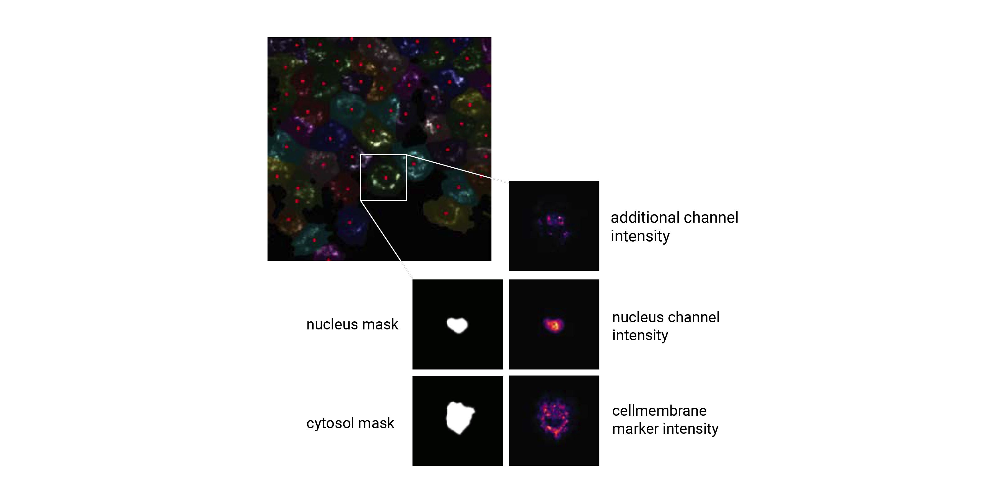
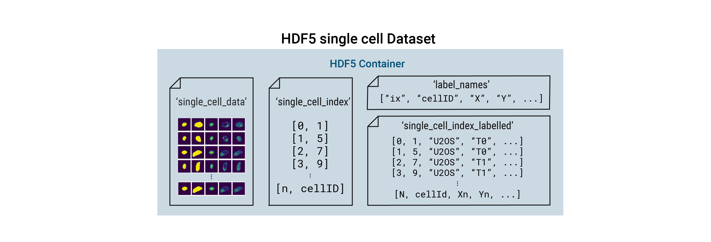

.. _extraction:

Extraction
==========

The SPARCSpy framework is built around the idea of generating standardized single-cell image datasets. A SPARCSpy single cell image dataset consists of a collection of images for each cell containing both the segmentation masks and imaging channels of that particular cell. 

These datasets are generated by cropping out image regions corresponding to individual cells from the original image during a process called extraction. During this process, the segmentation masks generated during the segmentation step are taken and applied to the original image. All pixels within the mask dimensions are preserved, while the pixels outside of the mask are set to ``0``. By using the segmentation masks to extract only those pixels that are annotated to belong to a given cell, SPARCSpy achieves exact clipping of individual cells from their background, eliminating noise from neighbouring cells. During this process, all single cell images are centered on their respective nuclei and the resulting single-cell images normalized to the the [0, 1] range. Extraction is only performed on cells that were fully imaged, i.e. their masks do not intersect with the image borders.

Extraction classes
------------------

SPARCSpy provides two classes for extracting single cell images :func:`HDF5CellExtraction <scportrait.pipeline.extraction.HDF5CellExtraction>` and :func:`TimecourseHDF5CellExtraction <scportrait.pipeline.extraction.TimecourseHDF5CellExtraction>`. The two classes are capable of extracting single-cell image datasets from classic SPARCSpy :func:`Project <scportrait.pipeline.project.Project>` and :func:`TimecourseProject <scportrait.pipeline.project.TimecourseProject>` respectively. While their functionality is very similar they differ slightly in how they handle the extraction to account for differences in data dimensionality.

Single-cell image datasets
--------------------------

For each cell, the extracted single-cell image dataset consists of a collection of images containing the segmentation masks and imaging channels of that particular cell. The segmentation masks are saved as binary masks, while the imaging channels are saved as float images normalized to the range ``[0, 1]``. During extraction the nuclear channel is masked using the nucleus mask, while all other imaging channels are masked using the cytosol mask. During this procedure the input mask is expanded slighly and a gaussian blur is applied to ensure that the entire cell is captured. Aggregated across all cells in a SPARCSpy dataset, the image collections for each cell are saved to ``HDF5``, a container file format that enables the retrieval of individual cells without loading the entire dataset. These ``HDF5`` datasets are the result of the extraction step and we refer to them as single-cell image datasets.

.. image:: ../images/single_cell_dataset.png
   :width: 100%

Besides containing the images themselves, the single-cell image datasets also contain annotation information for each cell within the dataset. In the minimal form this consists of a ``cellID``, which is a unique numerical identifier assigned to each cell during segmentation. By directly linking single-cell images to the ``cellID`` of the extracted cell this allows you to trace individual extracted cells back to their original position in the input image to e.g. select them for subsequent laser microdissection or look at their localization. Depending on the extraction method used, the single-cell image dataset can also contain additional labelling information.

