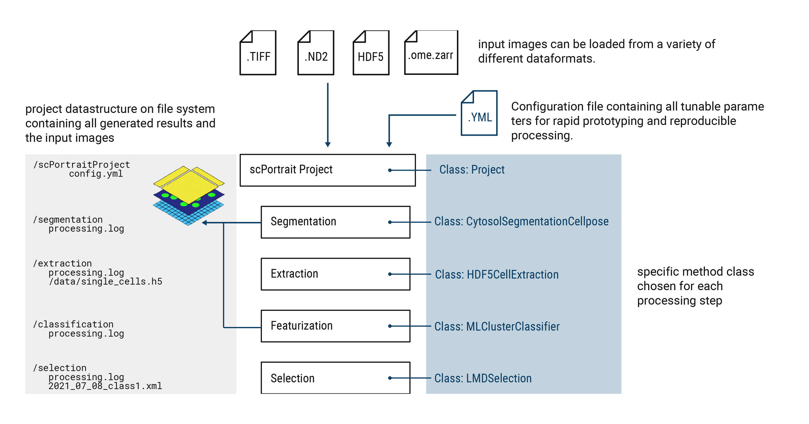

.. _projects:

scPortrait Projects
===================

Within scPortrait, all operations are centered around the concept of a ``Project``. A ``Project`` is a python class which manages all of the scPortrait processing steps and is the central element through which all operations are performed. Each ``Project`` directly maps to a directory on the file system which contains all of the inputs to a specific scPortrait run as well as the generated outputs. This directory also contains copies of the configuration file which specifies the parameters used for all methods associated with that run. This allows for easy reproducibility of results. 

Project classes
---------------
scPortrait provides several different ``Project`` classes which are designed to handle different input data types. Each ``Project`` class comes with its own set of segmentation and extraction methods which are tailored to the specific type of data. Please refer to the :ref:`segmentation <segmentation>` and :ref:`extraction <extraction>` sections for more details. Below you can find a brief outline of the different ``Project`` classes, what type of data structures they are suited for and their associated methods classes.

1. Project
++++++++++

The base :func:`Project <scportrait.pipeline.project.Project>` class is for single-timepoint, single-location data. If you for for example are working with fixed whole-slide images, as those you would aquire for downstream laser microdissection, this is the type of project class you would want to use.

Associated methods classes
**************************

1. segmentation methods: :func:`Segmentation <scportrait.pipeline.segmentation.Segmentation>`, :func:`ShardedSegmentation <scportrait.pipeline.segmentation.ShardedSegmentation>`  
2. extraction methods: :func:`HDF5CellExtraction <scportrait.pipeline.extraction.HDF5CellExtraction>`

2. TimecourseProject
+++++++++++++++++++++

The :func:`TimecourseProject <scportrait.pipeline.project.TimecourseProject>` class is for datasets with multiple input images, for example those generated via live-cell imaging.

Associated methods classes
**************************

1. segmentation methods: :func:`TimecourseSegmentation <scportrait.pipeline.segmentation.TimecourseSegmentation>`, :func:`MultithreadedTimecourseSegmentation <scportrait.pipeline.segmentation.MultithreadedTimecourseSegmentation>`   
2. extraction methods: :func:`TimecourseHDF5CellExtraction <scportrait.pipeline.extraction.TimecourseHDF5CellExtraction>`  

Initializing a scPortrait Project
---------------------------------

Each scPortrait project is mapped to a directory on the file system. The path to this directory is passed to the ``Project`` class during initialization. In case the directory does not yet exist it will be created during initialization.

.. code:: python
    :caption: Example code showing how to initializing a scPortrait Project

    from scportrait.pipeline.project import Project
    from scportrait.pipeline.segmentation import WGASegmentation
    from scportrait.pipeline.extraction import HDF5CellExtraction

    project = Project('/path/to/project/dir',
                      config_path = '/path/to/config/file',
                      segmentation_f = WGASegmentation,
                      extraction_f = HDF5CellExtraction,
                      classification_f = None,
                      selection_f = None,
                      overwrite = True,
                      debug = False
                    )

During initialization you also need to specify the path to a config file and assign a specific method class to each of the scPortrait workflow steps. The passed config file needs to contain entries for each of the chosen methods. For more details on the config file please refer to the ::ref:`config section <config>`.

During initialization you can also specify the projects general behaviour through two additional parameters: ``overwrite`` and ``debug``. If ``overwrite`` is set to ``True`` the results contained in the project directory will be overwritten if they already exist. If ``debug`` is set to ``True`` the scPortrait workflow will output additional information to the console that can be usefull for debugging purposes. It is not recommended to set ``debug`` to ``True`` for large datasets as this often generates many plots and additional output that will both slow down the workflow run and potentially lead to memory issues.

Loading Images into a scPortrait project
----------------------------------------

Once you have initialized a project, you can load images into it. Each scPortrait ``Project`` class is associated with several different methods to load the input images. 

